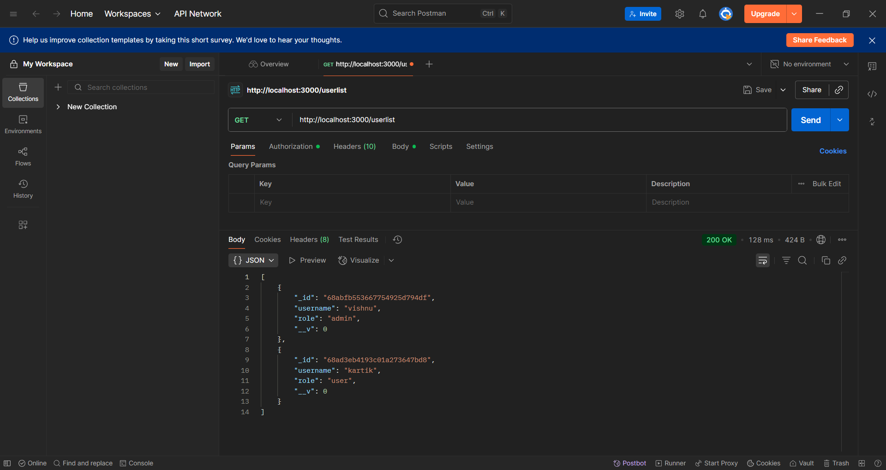
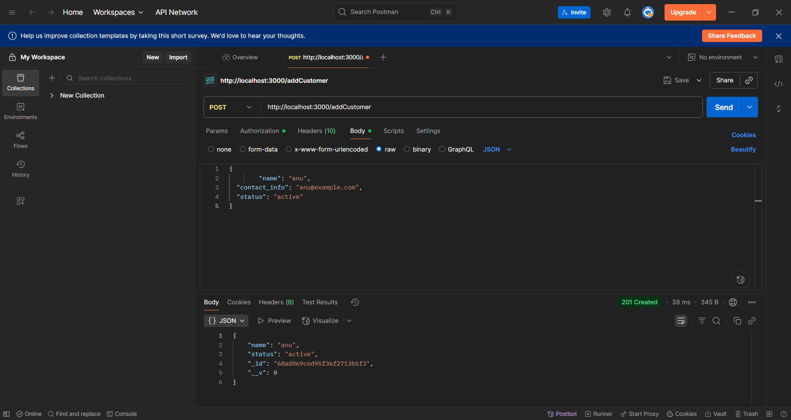
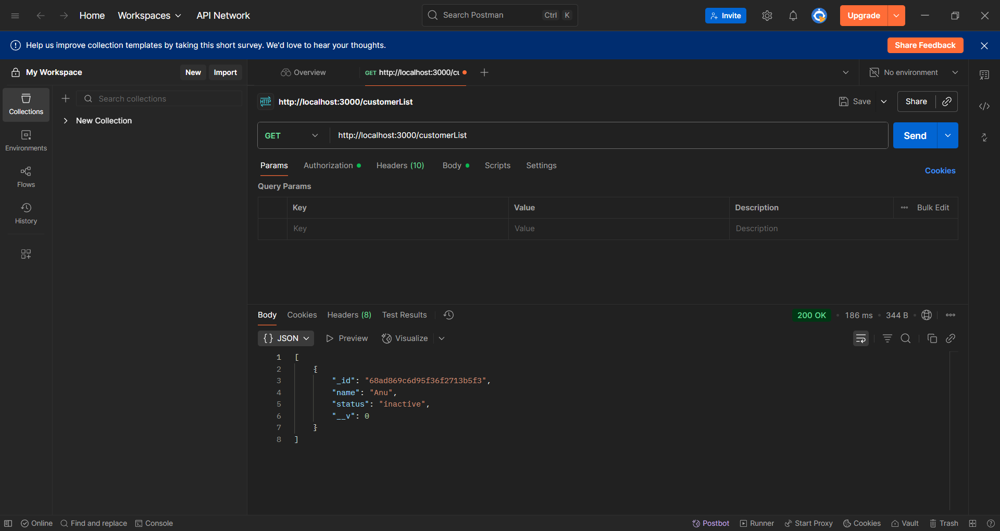
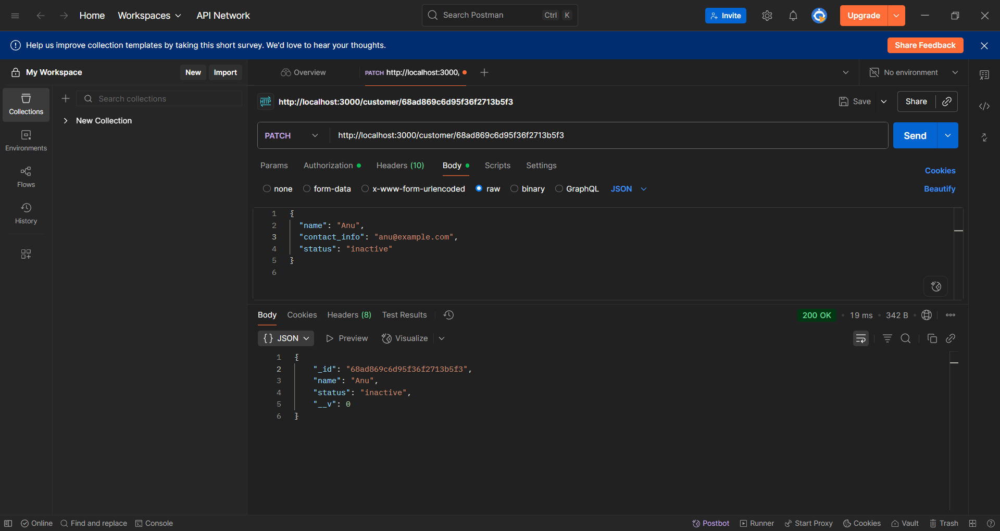
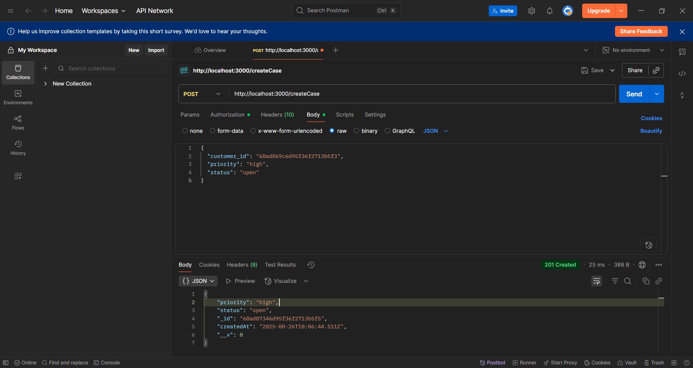
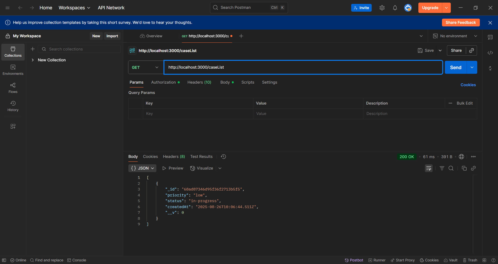
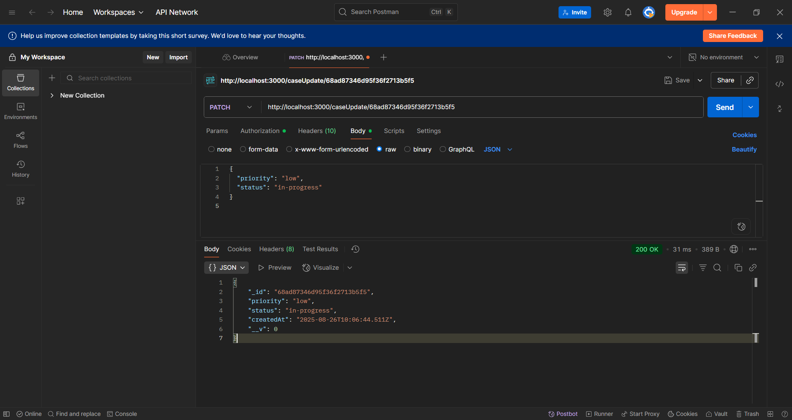
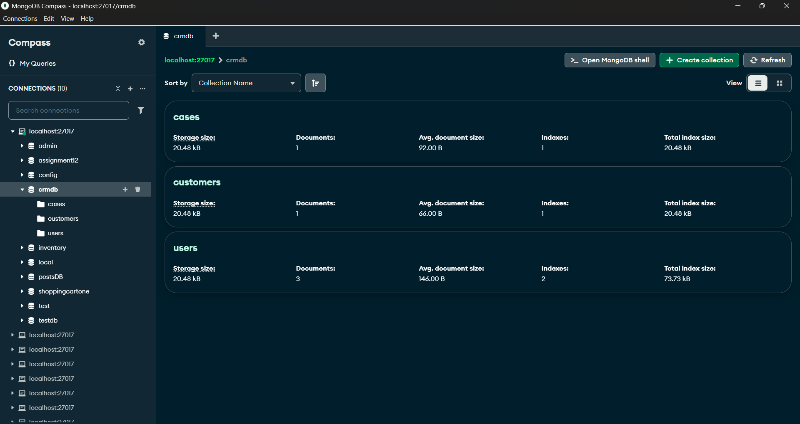

# CRM Backend (Node.js + Express + MongoDB)

A simple **CRM (Customer Relationship Management)** backend built with **Node.js, Express, and MongoDB**.  
This project manages **Users, Customers, and Cases** with CRUD operations and basic RESTful APIs.

---

## Features
- User management (Admin, Agent, Customer roles)
- Customer management (Add, update, list, delete)
- Case management (Create, assign, update status, list)
- MongoDB with Mongoose ODM
- RESTful API design
- Error handling & validation

---

## Tech Stack
- **Backend:** Node.js, Express.js  
- **Database:** MongoDB + Mongoose  
- **Auth (optional):** JWT for authentication/authorization  
- **Testing:** Postman   

---

## Screenshots

### List of all Users

### Create new user

### Login exisiting User

### Update User

### Add Customers

### Show all Customers

### Update Customer

### Create Case

### Show All Cases

### Case Update

### MongoDB Compass
